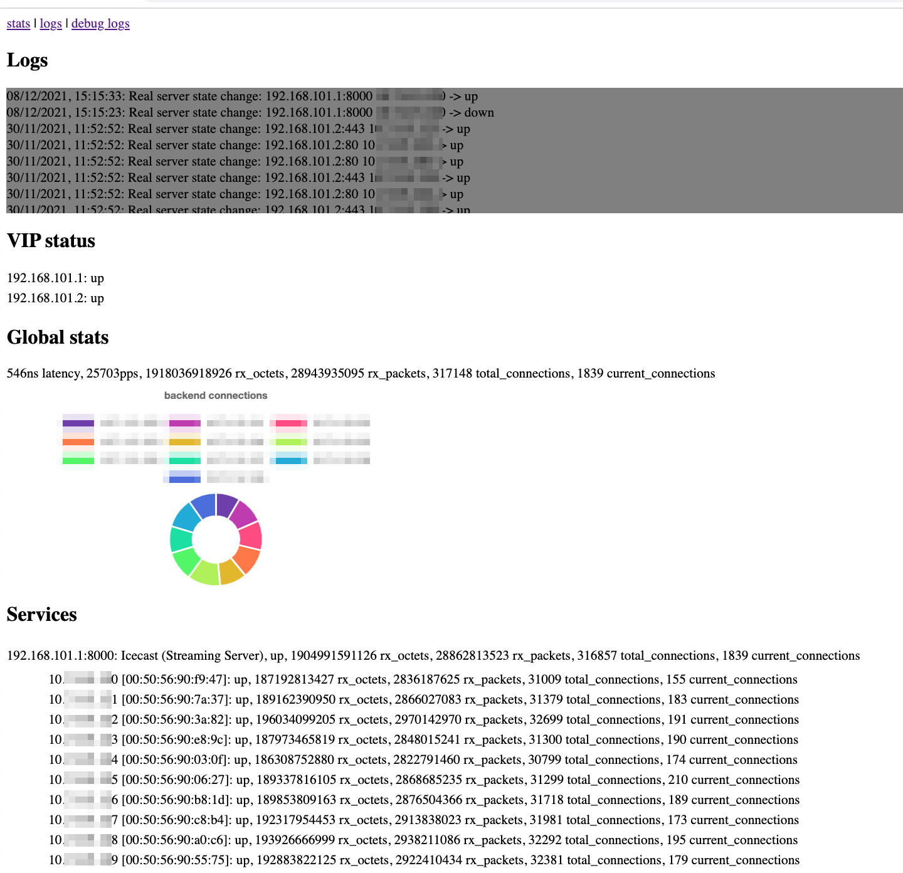

# VC5

A distributed Layer 2 Direct Server Return (L2DSR) Layer 4 load balancer (L4LB) for Linux using XDP/eBPF.

This is very much a proof of concept at this stage - most everything is incomplete and poorly defined!

If you think that this may be useful and have any questions/suggestions, feel free to contact me at d4v1dc0l3s@protonmail.com

## Homepage

The code is hosted at GitHub, https://github.com/davidcoles/vc5

Clone with `git clone https://github.com/davidcoles/vc5.git`


## Introduction (Why? What? How?)

This software is intended to replace the need for medium-to-large load
balancing appliances handling tens-to-hundreds of Gbit/s levels of
outbound traffic. Depending on application, hundreds of thousands, to
millions, of concurrently connected clients is the target.

VC5 uses a high-speed data path in the Linux kernel to switch traffic
at somewhere near wire speed on 10Gbit/s interfaces. When a packet is
received for a target service, a routine (which is loaded into the
running kernel with XDP), will replace the destination MAC address of
the packet with the address of one of the real servers in the
load-balancing pool and then bounce the packet straight back out of
the same interface on which it was received (changing VLAN tag, if
necessary).

When the real server receives the packet it sees the VIP (which it has
configured on a loopback interface) directed to its own MAC address,
processes the packet appropriately and sends the reply directly back
to the client, short-circuiting the load balancer. This is the Direct
Server Return model of load-balancing. A similar layer-3 version of
this is possible too (eg. using DSCP signalling, GRE or IP-in-IP
encapsulation), but this is not yet implemented.

The majority of traffic is likely to be asymmetric, with just a small
amount of traffic being sent to the server as (eg.) an HTTP request
and a significantly larger response sent back as a webpage or media
file. Because of this asymmetry, a load-balancer - which is only
involved in the receive path - can support, say, 100Gbit/s per second
downstream connection by only dealing with 10Gbit/s of request traffic
(HTTP request headers and ACK packets).

The VIP for the service is advertised to routers with BGP. Adding a
second instance results in the same IP
address being reachable from two different paths. If the router
supports Equal Cost Multi-Path (ECMP) routing then the traffic to the
VIP is balanced across both load balancing instances. Adding more
instances will horizintally scale the amount of traffic which can be
handled.

This is all good until something fails. With a basic hashing scheme
for backend servers, the failure of a single server results in the
hash of the 4-tuple (src/dst IP and port numbers) identifying the
connection ending up pointing to a different backend server, breaking
the connection. VC5 uses a rendezvous hashing scheme, which doesn't
have this property. When a new server is added to the pool then 1-in-N
connections would be disrupted. To avoid this each connection's state
is tracked in a local table.

If one of the load balalncers in an ECMP group fails then traffic will
be redistributed to a surviving instance. Quite probably the
rendezvous hashing scheme will select the right backend (as all LBs
see the same backends), but if the backend servers have changed since
the connection was established then this may not be the case and the
connection will be reset.

To avoid this, each load-balancing instance periodically multicasts
state information about active connections. In the event of an LB
instance failure, short-lived connections whould be maintained by the
hashing scheme and longer-lived connections should be maintained by
distributing state.

When the VC5 binary is run, a small embedded eBPF program is loaded
into the kernel with XDP. VC5 continues to run and populates XDP data
structures from userspace according to the contents of the JSON
configuration file. Healthchecks are run against backend servers and
the results are written to data structures in the kernel via XDP. The
packet processing code in the kernel reads the XDP data structures and
steers the traffic accordingly.

## Quickstart

It would be recommended to start out using a fresh virtual machine.

First we need a development environment capable of building libbpf and
Go binaries. Go 1.16 or later is needed due to using go:embed
directives. On Ubuntu 20.04 this can be achieved with:

  `apt-get install git build-essential libelf-dev clang libc6-dev libc6-dev-i386 llvm golang-1.16 libyaml-perl libjson-perl ethtool`
  
  `ln -s /usr/lib/go-1.16/bin/go /usr/local/bin/go`

Copy the [config.yaml](config.yaml) file to vc5.yaml and edit
appropriately for your routers/services/backends.

Run `make`. This will build the binary and transform the YAML config
file to a more verbose JSON config format.

Run the vc5.sh shell script with arguments of the binary, json file,
your IP address and network interface name, eg.:

  `./vc5.sh vc5/vc5 vc5.json 10.10.100.200 ens192`

If this doesn't bomb out then you should have a load balancer up and
running. A virtual network device and net namespace will be created
for performing healthchecks to VIPs on the backend servers. A
webserver (running on port 80 by default) will display logs,
statistics and backend status. There is Prometheus metric endpoint for
collecting statistics.



To dynamically alter the services running on the load balancer, change
the YAML file appropriately and regenerate the JSON file (`make
vc5.json`). Sending a HUP signal to the main process will cause it to
reload the JSON configuration file and apply any changes. The new
configuration will be reflected in the web console.

You can add static routing to forward traffic for a VIP to the load
balancer, or configure BGP peers in the YAML file to have routes
automatically injected to your routing table when services are
healthy.

If you don't have a routed environment then you can test with a client
machine on the same VLAN. Either add a static route on the client
machine pointing to the load balancer, or run BIRD/Quagga on client
and add the client's IP address to the BGP section of the YAML config.

Sample bird.conf snippet:

```
protocol bgp loadbalancers {
     description "loadbalancers";
     local as 65304;
     neighbor range 10.10.100.0/24 as 65304;

     ipv4 {
          export none;
          import filter {
                 if net ~ 192.168.101.0/24 then accept;
                 else reject;
          };
          next hop self;
     };

     passive on;
     direct;
}
```

If you enable ECMP on your router/client ("merge paths on;" in BIRD's
kernel protocol) then you can load balance traffic to multiple load
balancers. VC5 uses multicast to share a flow state table so peers
will learn about each other's connections and take over in the case of
one load balancer going down.

To use native driver mode in XDP a slighly more involved network setup
is needed at this stage. Run your physical interface in a bridge (see
sample netplan config in bridge.yaml) and add the -b flag to vc5.sh as
so:

  `./vc5.sh -b br0 10.10.100.200 enp130s0f1`

## Operation

There are two modes of operation, simple and VLAN based. In simple
mode all hosts must be on the same subnet as the primary address of
the load balancer. In VLAN mode (enabled by declaring entries under
the "vlan" section), all server entries must match a VLAN/CIDR subnet
entry. VLAN tagged interfaces need to be created in the OS and have an
IP address assigned within the subnet, and the interface names must be
of the (printf) form "vlan%d" (vlan2, vlan53, vlan1356, etc.).

Traffic into the load balancer needs to be on a tagged VLAN (no
pushing or popping of 802.1Q is done). The IP address specified on the
command line will be used to bind the connection to BGP peers, so
should be on one of the VLAN tagged interfaces (with appropriate
routing for BGP egress if the router is not on the same subnet,
eg. route reflectors).

Sample netplan and VC5 configurations are in the
[examples/](examples/) directory.


## Performance

This has mostly been tested using Icecast backend servers with clients
pulling a mix of low and high bitrate streams (48kbps - 192kbps).

It seems that a VMWare guest (4 core, 8GB) using the XDP generic
driver will comfortably support 100K concurrent clients,
380Mbps/700Kpps through the load balancer and 8Gbps of traffic from
the backends directly to the clients.

A server with an Intel Xeon CPU (E52620 @ 2.40GHz) with 6 physical
cores and an Intel 10Gbps NIC (ixgbe driver) in native mode will
support upwards of 500K clients, 2Gbps/3.5Mpps and 40Gbps traffic back
to clients. This was at a load of ~25% on the CPU - clearly it can do
significantly more than this, but resources for running more client
and backend servers were not available at the time.


## TODOs

* IPIP/GRE/DSCP L3 support
* Least conns support / Take most loaded server out of pool
* Multicast status to help last conns check
* More complete BGP4 implementation
* BFD implementation

## Configuration

The [config.yaml](config.yaml) file should have a commentary detailing
the structure. To see the underlying JSON structure, you can run
`tools/config.pl config.yaml`. The JSON format is significantly more
verbose and everything is explicitly specified.

The goal of the YAML format is to have a reasonably concise
human-readable configuration which is then rendered into an explcit
format. If the YAML format does not quite suit your needs then you can
write your own generator (eg. an HAProxy L7 balancing layer behind the
L4 layer, with a single config format used to generate both HAProxy
and VC5 configurations).


## Notes

https://wiki.nftables.org/wiki-nftables/index.php/Performing_Network_Address_Translation_(NAT)

https://unix.stackexchange.com/questions/429077/how-to-do-nat-based-on-port-number-in-stateless-nat


Set destination IP address on real server by DSCP - for L3 DSR

* `nft add table raw`
* `nft add chain raw prerouting { type filter hook prerouting priority raw \; }`
* `nft add rule raw prerouting ip dscp 0x04 ip daddr set 192.168.101.4 notrack`

https://lpc.events/event/11/contributions/950/attachments/889/1704/lpc_from_xdp_to_socket_fb.pdf

https://github.com/xdp-project/xdp-tutorial.git

