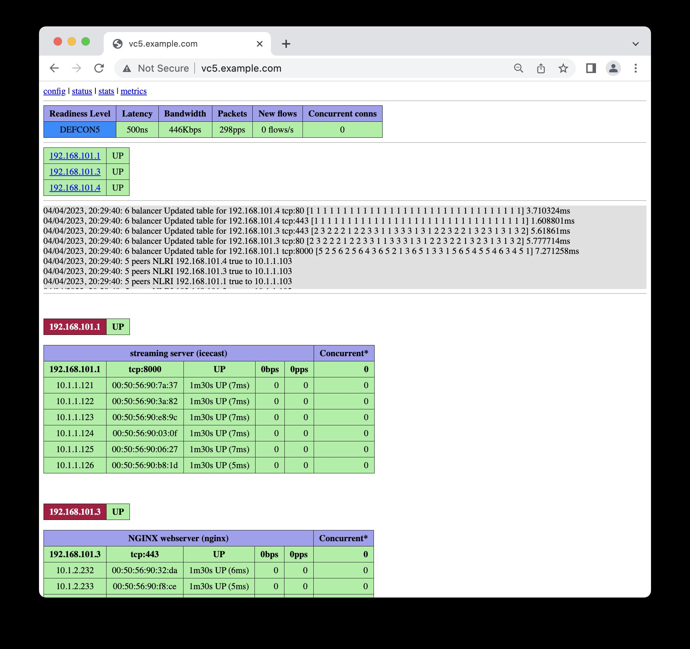
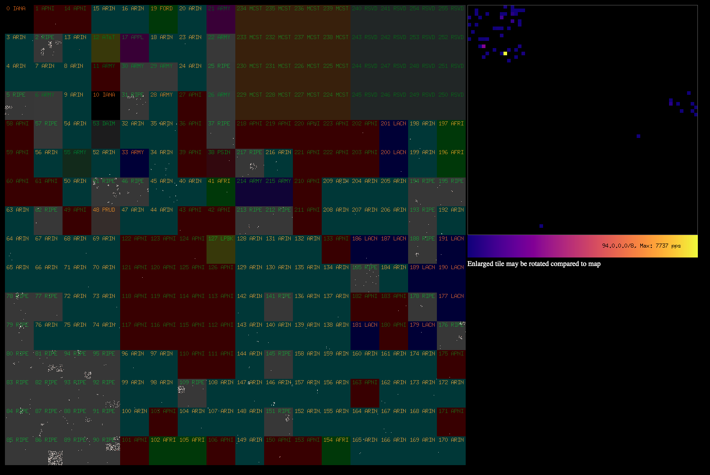

# VC5

Primarily a distributed Layer 2 Direct Server Return
([DSR](https://www.loadbalancer.org/blog/direct-server-return-is-simply-awesome-and-heres-why/))
Layer 4 load balancer (L4LB) for Linux using XDP/eBPF.

It is currently undergoing modification to work with other balancing
solutions, such as the Linux Virtual Server/IPVS implementation (see
https://github.com/davidcoles/stayinalived).

Currently you would be best advised to use the binary/code from the
latest release rather than HEAD.

If you think that this may be useful and have any
questions/suggestions, feel free to contact me at vc5lb@proton.me or raise a GitHub issue.

## Homepage

The code is hosted at GitHub, https://github.com/davidcoles/vc5

Clone with `git clone https://github.com/davidcoles/vc5.git`

[Documentation and quick start guide](docs/README.md)

## Goals/status

* ✅ Simple deployment with a single binary
* ✅ Stable backend selection with Maglev hashing algorithm
* ✅ Route health injection handled automatically; no need to run other software such as ExaBGP
* ✅ Minimally invasive; does not require any modification of iptables rules on server
* ✅ No modification of backend servers beyond adding the VIP to a loopback device
* ✅ Health-checks run against the VIP on backend servers, not their real addresses
* ✅ HTTP/HTTPS, half-open SYN probe and UDP/TCP DNS healthchecks
* ✅ As close as possible to line-rate 10Gbps performance
* ✅ In-kernel code execution with XDP/eBGP; native mode drivers bypass sk_buff allocation
* ✅ (D)DoS mitigation with fast early drop rules
* ✅ Multiple VLAN support
* ✅ Multiple NIC support for lower bandwidth/development applications
* ✅ Works with bonded network devices to support high-availibility/high-bandwidth
* ✅ Observability via a web console and Prometheus metrics
* 🚧 Simple API to enable embedding into your own project
* 🚧 Extension to support LVS/IPVS for non-DRS operation

## About

VC5 is a network load balancer designed to work as replacement for
legacy hardware appliances. It allows a service with a Virtual IP
address (VIP) to be distributed over a set of real servers. Real
servers might run the service themselves or act as proxies for another
layer of servers (eg. HAProxy serving as a Layer 7 HTTP router/SSL
offload). The only requirement being that the VIP needs to be
configured on a loopback device on real server, eg.: `ip a add
192.168.101.1/32 dev lo`

One server with a 10Gbit/s network interface should be capable of
supporting an HTTP service in excess of 100Gbit/s egress bandwidth due
to the asymmetric nature of most internet traffic. For smaller
services a modest virtual machine or two will likely handle a service
generating a number of Gbit/s of egress traffic.

If one instance is not sufficient then more servers may be added to
horizontally scale capacity (and provide redundancy) using your
router's ECMP feature. 802.3ad bonded interfaces and 802.1Q VLAN
trunking is supported (see [examples/](examples/) directory).

No kernel modules or complex setups are required, although for best
performance a network card driver with XDP native mode support is
required (eg.: mlx4, mlx5, i40e, ixgbe, ixgbevf, nfp, bnxt, thunder,
dpaa2, qede). A full list is availble at [The XDP Project's driver
support page](https://github.com/xdp-project/xdp-project/blob/master/areas/drivers/README.org).

A good summary of the concepts in use are discussed in [Patrick
Shuff's "Building a Billion User Load Balancer"
talk](https://www.youtube.com/watch?v=bxhYNfFeVF4&t=1060s) and [Nitika
Shirokov's Katran talk](https://www.youtube.com/watch?v=da9Qw7v5qLM)

A basic web console and Prometheus metrics server is included: 

A sample utility to render traffic from /20 prefixes going through the
load-balancer is in the [cmd/hilbert/](cmd/hilbert/) directory:


A good use for the traffic stats would be to track which prefixes are
usually active and to generate a table of which /20s to early drop
traffic from in the case of a DoS/DDoS (particularly spoofed source
addresses).

Initially this began as self-contained director/balancer
project. Recently, it seems that the healthchecking, route health
injection and observability portions could be re-used with a non-DSR
balancer such as Linux's virtual server. As such, I am currently
modifying the code to allow switching out the eBPF/XDP portion so that
a project using this library can bring its own implemention.

Consequently, the old configuration schema needs updating and old
versions will no longer work. For now I will maintain a backwards
compatible v0.1 branch with bugfixes, etc., but the main branch will
begin using a new updated config parser script.


## Operation

There are three modes of operation, simple, VLAN, and multi-NIC
based. In simple mode all hosts must be on the same subnet as the
primary address of the load balancer. In VLAN mode (enabled by
declaring entries under the "vlans" section of the YAML/JSON config
file), server entries should match a VLAN/CIDR subnet entry. VLAN
tagged interfaces need to be created in the OS and have an IP address
assigned within the subnet. In multi-NIC mode subnets are tagged in
the same manner as VLANs, but bpf_redirect() is used to send traffic
out of the appropriate interface (rather than changing the VLAN ID and
using XDP_TX).

In VLAN mode, traffic into the load balancer needs to be on a tagged VLAN (no
pushing or popping of 802.1Q is done - yet). The IP address specified on the
command line will be used to bind the connection to BGP peers, and so
should be on one of the VLAN tagged interfaces (with appropriate
routing for BGP egress if the router is not on the same subnet,
eg. route reflectors).

Sample netplan and VC5 configurations are in the
[examples/](examples/) directory.

A Multi-NIC mode has been added (-m flag) to `vc5ng`. Subnets matching
each (untagged) NIC should be declared with an arbitrary "VLAN ID" in
the config file. The code will discover the IP address/interface
bindings and use bpf_redirect() to forward packets out the correct
interface. This makes it possible to have multiple VLANs supported on
a VMWare virtual machine with multiple network interfaces - trunked
VLANs are not easily supported on VMWare as there is an all-or-nothing
approach, which may not be practical/desirable in a large installation.


## Development

Ultimately, it would be good to be able to use this as a library such
that the frontend can be controlled by the user. The configuration
could be generated from a dynamic source such as nodes that want to
participate in a pool for a service subscribing to a ZooKeeper
cluster, or pulled as JSON from an HTTP endpoint. A minimal code
snippet for getting a loadbalancer up and running (after obtaining an
initial config) could look like:

```
lb := &vc5.LoadBalancer{
  Native:          true,
  Socket:          "/run/vc5socket",
  NetnsCommand:    []string{os.Args[0], "-s", "/run/vc5socket"},
  Interfaces:      []string{"enp130s0f0", "enp130s0f1"},
  EgressInterface: "bond0",
}

err = lb.Start("10.1.2.3", healthchecks)

if err != nil {
  log.Fatal(err)
}
```

With subsequent configuration updates communicated with
`lb.Update(healthchecks)`. Status and statistics can be obtained from
the `lb` object.


## Performance

This has mostly been tested using Icecast backend servers with clients
pulling a mix of low and high bitrate streams (48kbps - 192kbps).

It seems that a VMWare guest (4 core, 8GB) using the XDP generic
driver will support 100K concurrent clients, 380Mbps/700Kpps through
the load balancer and 8Gbps of traffic from the backends directly to
the clients.

A bare-metal server with an Intel Xeon CPU (E52620 @ 2.40GHz) with 6
physical cores and an Intel 10Gbps NIC (ixgbe driver) in native mode
will support upwards of 500K clients, 2Gbps/3.5Mpps and 40Gbps traffic
back to clients. This was at a load of ~25% on the CPU - clearly it
can do significantly more than this, but resources for running more
client and backend servers were not available at the time.


## TODOs

* IPIP/GRE/DSCP L3 support
* Multicast status to help last conns check
* More complete BGP4 implementation
* BFD implementation (maybe no need for this with 3s hold time)


## Notes

My scribblings - likely not useful to anyone else ...

https://wiki.nftables.org/wiki-nftables/index.php/Performing_Network_Address_Translation_(NAT)

https://unix.stackexchange.com/questions/429077/how-to-do-nat-based-on-port-number-in-stateless-nat


Set destination IP address on real server by DSCP - for L3 DSR

* `nft add table raw`
* `nft add chain raw prerouting { type filter hook prerouting priority raw \; }`
* `nft add rule raw prerouting ip dscp 0x04 ip daddr set 192.168.101.4 notrack`

https://lpc.events/event/11/contributions/950/attachments/889/1704/lpc_from_xdp_to_socket_fb.pdf

https://github.com/xdp-project/xdp-tutorial.git

https://lpc.events/event/2/contributions/71/attachments/17/9/presentation-lpc2018-xdp-tutorial.pdf


Latencies - 120K clents virtual LB:
802069 pps, 140 ns avg. latency, DEFCON 1
794173 pps, 185 ns avg. latency, DEFCON 2
795669 pps, 315 ns avg. latency, DEFCON 3
801284 pps, 313 ns avg. latency, DEFCON 4
801062 pps, 320 ns avg. latency, DEFCON 5

https://yhbt.net/lore/xdp-newbies/CANLN0e5_HtYC1XQ=Z=JRLe-+3bTqoEWdbHJEGhbF7ZT=gz=ynQ@mail.gmail.com/T/


