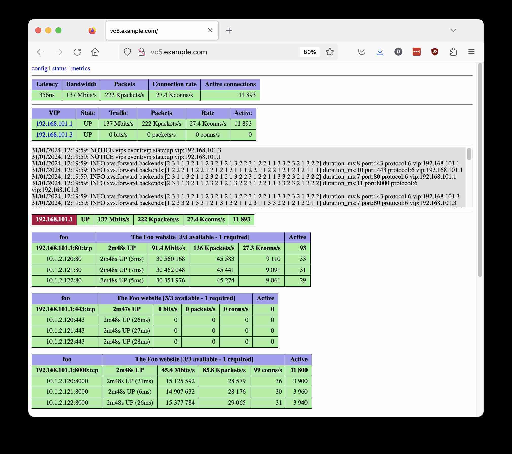
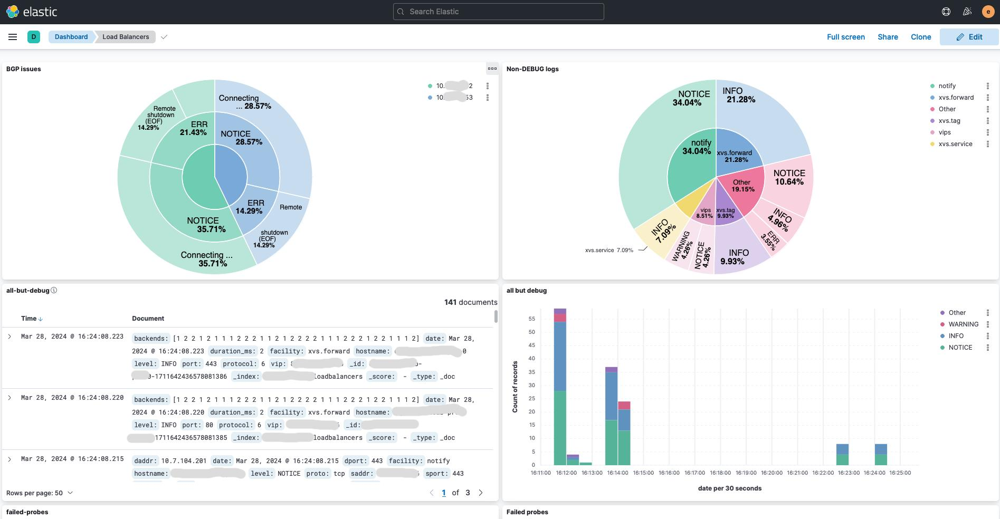

# VC5

<picture>
  
</picture>

**This README is currently being updated to reflect recent changes -
  some information may not reflect the current codebase. This
  iteration of code is not yet battle ready - use a v0.2 release for
  production**

A horizontally scalable Direct Server Return
([DSR](https://www.loadbalancer.org/blog/direct-server-return-is-simply-awesome-and-heres-why/))
layer 4 load balancer (L4LB) for Linux using [XDP/eBPF](https://www.datadoghq.com/blog/xdp-intro/).

If you think that this may be useful or have any
questions/suggestions, feel free to contact me at vc5lb@proton.me or
raise a GitHub issue.

**Now supports IPv6 and distribution at layer 3 (AKA
tunnelling)**! The XVS library has been updated to include these
features, and also does away with the need to run health checks from
a network namespace, considerably simplifying the code. This will end
the requirement that all backends share a VLAN with the load balancer.

Code restrictions currently mean that enabling tunnelling on a
per-service basis is not supported. Using the `-tunnel` option allows a
layer 3 tunnelling to be globally enabled using a single scheme
(IP-in-IP, GRE, FOU or GUE). Going forward, the code will be updated
to allow for tunnelling to be configured at the service level.

Layer 2 load balancing will continue to be supported - the primary
reason for starting the project was because of the lack of layer 2
support by [Facebook's
Katran](https://github.com/facebookincubator/katran) load
balancer.

A [sample IPv6/L3 configuration file](doc/ipv6-l3.yaml) is included -
better documentation to follow.


## About

VC5 is a network load balancer designed to work as replacement for
legacy hardware appliances. It allows services with virtual IP
addresses (VIPs) to be distributed to sets of backend ("real")
servers. Real servers might run the services themselves or act as
proxies for another layer of servers (eg. HAProxy serving as a layer 7
HTTP router/SSL offload when application layer decisions need to
made). The only requirement being that VIPs need to be configured on a
loopback device on each real server, eg.: `ip addr add
192.168.101.1/32 dev lo`

Services and real servers are specified in a configuration file, along
with health check definitions. When the backend servers pass checks
and enough are available to provide a service, then virtual IP
addresses are advertised to routers via BGP.

Distributing traffic at both layer 2 and layer 3 is now
supported. Layer 2 distribution requires that real servers share a
VLAN with the load balancer; upon receiving a packet to be
distributed, the load balancer updates the ethernet hardware addresses
in the packet to use the real server's MAC address as the destination
and its own MAC address as the source, and forwards the packet via the
appropriate interface, updating the 802.1Q VLAN ID if packets are VLAN
tagged.

Layer 3 distribution requires packets to be encapsulated in a
tunneling protocol addressed to the real server IP and forwarded via a
router (unless the server and laod balancer share a VLAN). If, when
encapsulated, a packet exceeds the network maximum trasmission size
then an ICMP message is sent to the source with advice as to the
appropriate MTU to use. Backend servers only need to decapsulate
packets - bidirectional tunneling with load balancers is not required.

One server with a 10Gbit/s network interface should be capable of
supporting an HTTP service in excess of 100Gbit/s egress bandwidth due
to the asymmetric nature of most internet traffic. For smaller
services a modest virtual machine or two will likely handle a service
generating a number of gigabit/s of egress traffic.

If one instance is not sufficient then more servers may be added to
horizontally scale capacity (and provide redundancy) using your
router's ECMP feature. 802.3ad bonded interfaces and 802.1Q VLAN
trunking is supported (see [examples/](examples/) directory).

No kernel modules or complex setups are required, although for best
performance a network card driver with XDP native mode support is
recommended (eg.: mlx4, mlx5, i40e, ixgbe, ixgbevf, nfp, bnxt, thunder,
dpaa2, qede). A full list is availble at [The XDP Project's driver
support page](https://github.com/xdp-project/xdp-project/blob/master/areas/drivers/README.org).

## Goals/status

* ✅ Simple deployment with a single binary
* ✅ Stable backend selection with the Maglev hashing algorithm
* ✅ Route health injection handled automatically; no need to run other software such as ExaBGP
* ✅ Minimally invasive; does not require any modification of iptables rules on balancer
* ✅ No modification of backend servers beyond adding the VIP to a loopback device/tunnel termination with L3 distribution
* ✅ Health checks are run against the VIP on backend servers, not their real addresses
* ✅ HTTP/HTTPS, half-open SYN probe and UDP/TCP DNS health checks built in
* ✅ In-kernel packet switching with eBPF/XDP; native mode drivers avoid sk_buff allocation
* ✅ Multiple VLAN support
* ✅ Multiple NIC support for lower bandwidth/development applications
* ✅ Tagged/bonded network devices to support high-availibility/high-bandwidth
* ✅ Observability via a web console, Elasticsearch logging (in development) and Prometheus metrics
* ✅ IPv6 support and ability to mix IPv4 and IPv6 backends with either type of VIP.
* ✅ Layer 3 traffic distribution with IP-in-IP, GRE, FOU and GUE support.

## Quickstart

For best results you should disable/uninstall irqbalance.

You will need to select a primary IP to pass to the balancer. This is
used for the BGP router ID.

A simple example on a server with a single, untagged ethernet interface:

* `apt-get install git make libelf-dev golang-1.20 libyaml-perl libjson-perl ethtool` (or your distro's equivalent)
* `ln -s /usr/lib/go-1.20/bin/go /usr/local/bin/go` (ensure that the Go binary is in your path)
* `git clone https://github.com/davidcoles/vc5.git`
* `cd vc5/cmd`
* `cp config.sample.yaml config.yaml` (edit config.yaml to match your requirements)
* `make` (pulls down the [libbpf](https://github.com/libbpf/libbpf) library, builds the binary and JSON config file)
* `./vc5 10.1.10.100 config.json eth0` (amend to use your server's IP address and ethernet interface)
* A web console will be on your load balancer server's port 80 by default
* Add your VIP to the loopback device on your backend servers (eg.: `ip addr add 192.168.101.1/32 dev lo`)
* Configure your network/client to send traffic for your VIP to the load balancer, either via BGP (see config file) or static routing

It is almost certainly easier to use the binary from the latest Github
release (compiled for x86-64). This will have been tested in
production so should be reliable. Ensure that your configuration is
compatible with this version by using the config.pl script from the
tagged release (or, of course, you can build your own JSON config
however you prefer).

If you update the YAML config file and regenerate the JSON (`make
config.json`) you can reload the new configuration by sending an a
SIGINT (Ctrl-C) or SIGUSR2 to the process. SIGQUIT (Ctrl-\\) or SIGTERM
will cause the process to gracefully shut down BGP connections and
exit.

A more complex example with an LACP bonded ethernet device consisting
of two (10Gbps Intel X520 on my test server) interfaces, with native
XDP driver mode enabled and tagged VLANs:

`config.yaml` vlans entry: 

```
vlans:
  10: 10.1.10.0/24
  20: 10.1.20.0/24
  30: 10.1.30.0/24
```

Command line:

`./vc5 -n 10.1.10.100 config.json enp130s0f0 enp130s0f1`

The binary will detect your VLAN interfaces by looking for devices
with IP addreses which are contained in the VLAN prefixes in the
configuration file. If you use separate untagged physical interfaces
then this should now work transparently without any extra
configuration, just list all of the interfaces on the command line so
that the eBPF code is loaded into each of them.

Because connection state is tracked on a per-core basis
(BPF_MAP_TYPE_LRU_PERCPU_HASH), you should ensure that RSS ([Receive
Side
Scaling](https://www.kernel.org/doc/Documentation/networking/scaling.txt))
will consistently route packets for a flow to the same CPU core in the
event of your switch slecting a different interface when the LACP
topology changes. Disable irqbalance, ensure that channel settings are
the same on each interface (ethtool -l/-L) and that RSS flow hash
indirection matches (ethtool -x/-X).

The setup can be tested by starting a long running connection
(eg. using iperf with the -t option) to a set of backend servers, then
[disabling the chosen backend with an asterisk after the IP address in
the config file](doc/servers.md), determining which interface is
receiving the flow on the load balancer (eg., `watch -d 'cat
/proc/interrupts | grep enp130s0f'` and look for the rapidly
increasing IRQ counter) and then dropping this interface out of LACP
(`ifenslave -d bond0 enp130s0f0`). You should see the flow move to the
other network interface but still hit the same core.

When using backends in multiple subnets, for best performance you
should ensure that all VLANs are tagged on a single trunk interface
(LACP bonded if you have more than one physical interface) with
subnet/VLAN ID mappings specified in the `vlans` section of the config
file.

If this is not possible (for example creating trunked interfaces on
vSphere is not simple), then you can assign each subnet to a different
untagged interface:

`./vc5 10.1.10.100 config.json eth0 eth1 eth2`


## Background/more info

A good summary of the concepts in use are discussed in [Patrick
Shuff's "Building a Billion User Load Balancer"
talk](https://www.youtube.com/watch?v=bxhYNfFeVF4&t=1060s) and [Nitika
Shirokov's Katran talk](https://www.youtube.com/watch?v=da9Qw7v5qLM)

A basic web console and Prometheus metrics server is included: 

Experimental elasticsearch support for logging (direct to your
cluster, no need to scrape system logs) is now included. Every probe
to backend servers is logged, so if one goes down you can see
precisely what error was returned, as well all sorts of other
conditions. This will require a lot of refinement and more sensible
naming of log parameters, etc. (if you've got any insights please get
in touch), but it should lead to being able to get some good insights
into what is going on with the system - my very inept first attempt
creating a Kibana dashboard as an example: 


## Performance

This has mostly been tested using Icecast backend servers with clients
pulling a mix of low and high bitrate streams (48kbps - 192kbps).

It seems that a VMWare guest (4 core, 8GB) using the XDP generic
driver will support 100K concurrent clients, 380Mbps/700Kpps through
the load balancer and 8Gbps of traffic from the backends directly to
the clients.

On a single (non-virtualised) Intel Xeon Gold 6314U CPU (2.30GHz 32
physical cores, with hyperthreading enabled for 64 logical cores) and
an Intel 10G 4P X710-T4L-t ethernet card, I was able to run 700K
streams at 2Gbps/3.8Mpps ingress traffic and 46.5Gbps egress. The
server was more than 90% idle. Unfortunately I did not have the
resources available to create more clients/servers.


## Operation

There are three modes of operation, simple, VLAN, and multi-NIC
based. In simple mode all hosts must be on the same subnet as the
primary address of the load balancer. In VLAN mode (enabled by
declaring entries under the "vlans" section of the YAML/JSON config
file), server entries must match a VLAN/CIDR subnet entry. VLAN tagged
interfaces need to be created in the OS and have an IP address
assigned within the subnet. In multi-NIC mode subnets are given IDs in
the same manner as VLANs, but bpf_redirect() is used to send traffic
out of the appropriately configured interface (rather than changing
the VLAN ID and using XDP_TX).

In VLAN mode, all traffic for the load balancer needs to be on a tagged VLAN (no
pushing or popping of 802.1Q is done - yet).


