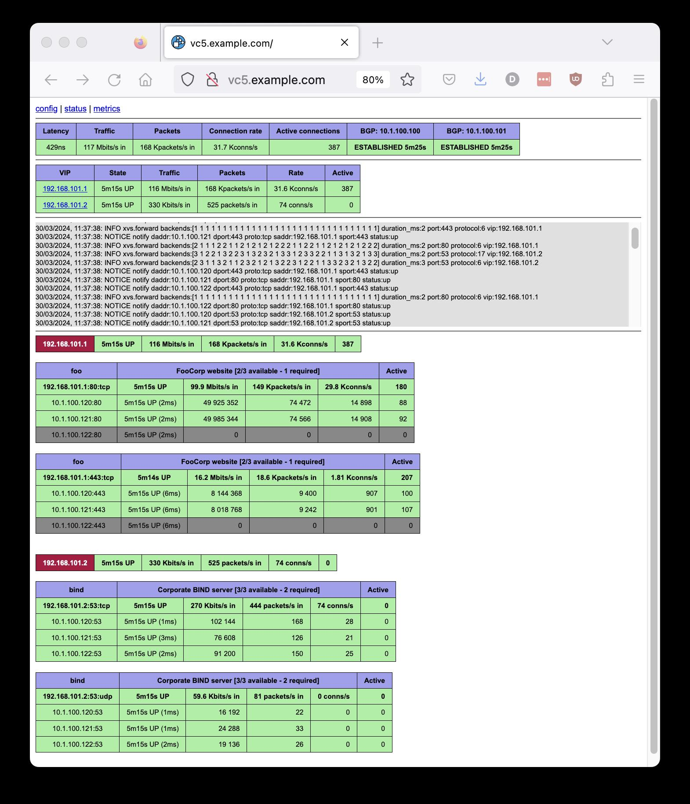

# VC5

A horizontally scalable layer 2 Direct Server Return
([DSR](https://www.loadbalancer.org/blog/direct-server-return-is-simply-awesome-and-heres-why/))
layer 4 load balancer (L4LB) for Linux using XDP/eBPF.

The repository is for the `vc5` binary (in the [cmd/](cmd/)
directory).

The Go module that was included here has now been removed - the v0.1
branch is still available if you need it.

The code for eBPF/XDP has been split out into the
[xvs](https://github.com/davidcoles/xvs) repository - the object file
is now committed to this repository and so does not need to be built
as a seperate step.

The code for managing services, carrying out health checks and
speaking to BGP peers has been split out to the
[cue](https://github.com/davidcoles/cue) repository, which allows it
to be reused by other projects which use a different load balancing
implementation
(eg., [LVS/IPVS](https://en.wikipedia.org/wiki/IP_Virtual_Server)).

This README is currently out of date and is in the process of being
updated. It's broadly applicable, but some specifics are wrong.

Basically, to build it you should install dependencies (see the
`ubuntu-dependencies` Makefile rule) and run `make` in the `cmd/`
directory.

The process will checkout and build the
[libbpf](https://github.com/libbpf/libbpf) library which the binary
needs to link against.

If you think that this may be useful and have any
questions/suggestions, feel free to contact me at vc5lb@proton.me or
raise a GitHub issue.

## NOTICE

YAML/JSON config format changed to include LB server's IP and
interfaces, native mode, etc.. There can still be specified on the
command line if easier.

## Quickstart

A simple example on a server with a single, untagged ethernet interface:

* `apt-get install git make libelf-dev golang-1.20 libyaml-perl libjson-perl ethtool` (or your distro's equivalent)
* `ln -s /usr/lib/go-1.20/bin/go /usr/local/bin/go` (ensure that the Go binary is in your path)
* `git clone https://github.com/davidcoles/vc5.git`
* `cd vc5/cmd`
* `cp config.sample.yaml config.yaml` (edit config.yaml to match your requirements)
* `make` (builds the binary and JSON config file)
* `./vc5 config.json 10.1.10.100 eth0` (amend to use your server's IP address and ethernet interface)
* A web console will be on your load balancer server's port 80 by default
* Add your VIP to the loopback device on your backend servers (eg.: `ip addr add 192.168.101.1/32 dev lo`)
* Configure your network/client to send traffic for your VIP to the load balancer, either via BGP (see config file) or static routing

## Goals/status

* ✅ Simple deployment with a single binary
* ✅ Stable backend selection with Maglev hashing algorithm
* ✅ Route health injection handled automatically; no need to run other software such as ExaBGP
* ✅ Minimally invasive; does not require any modification of iptables rules on balancer
* ✅ No modification of backend servers beyond adding the VIP to a loopback device
* ✅ Health checks are run against the VIP on backend servers, not their real addresses
* ✅ HTTP/HTTPS, half-open SYN probe and UDP/TCP DNS health checks built in
* ✅ In-kernel code execution with eBPF/XDP; native mode drivers avoid sk_buff allocation
* ✅ Multiple VLAN support
* ✅ Multiple NIC support for lower bandwidth/development applications
* ✅ Works with bonded network devices to support high-availibility/high-bandwidth
* ✅ Observability via a web console, Elasticsearch logging (in development) and Prometheus metrics

## Performance

This has mostly been tested using Icecast backend servers with clients
pulling a mix of low and high bitrate streams (48kbps - 192kbps).

It seems that a VMWare guest (4 core, 8GB) using the XDP generic
driver will support 100K concurrent clients, 380Mbps/700Kpps through
the load balancer and 8Gbps of traffic from the backends directly to
the clients.

On a single (non-virtualised) Intel Xeon Gold 6314U CPU (2.30GHz 32
physical cores, with hyperthreading enabled for 64 logical cores) and
an Intel 10G 4P X710-T4L-t ethernet card, I was able to run 700K
streams at 2Gbps/3.8Mpps ingress traffic and 46.5Gbps egress. The
server was more than 90% idle. Unfortunately I did not have the
resources available to create more clients/servers.

## About

VC5 is a network load balancer designed to work as replacement for
legacy hardware appliances. It allows a service with a Virtual IP
address (VIP) to be distributed over a set of real servers. Real
servers might run the service themselves or act as proxies for another
layer of servers (eg. HAProxy serving as a Layer 7 HTTP router/SSL
offload). The only requirement being that the VIP needs to be
configured on a loopback device on real server, eg.: `ip addr add
192.168.101.1/32 dev lo`

Currently only layer 2 load balancing is performed. This means that
the load balancer instance needs to have an interface configured for
each subnet where backend servers are present. This can be achieved
with seperate untagged physical NICs, or a trunked/tagged NIC or bond
device with VLAN subinterfaces. For performance reasons, the tagged
VLAN model is preferable.

One server with a 10Gbit/s network interface should be capable of
supporting an HTTP service in excess of 100Gbit/s egress bandwidth due
to the asymmetric nature of most internet traffic. For smaller
services a modest virtual machine or two will likely handle a service
generating a number of Gbit/s of egress traffic.

If one instance is not sufficient then more servers may be added to
horizontally scale capacity (and provide redundancy) using your
router's ECMP feature. 802.3ad bonded interfaces and 802.1Q VLAN
trunking is supported (see [examples/](examples/) directory).

No kernel modules or complex setups are required, although for best
performance a network card driver with XDP native mode support is
required (eg.: mlx4, mlx5, i40e, ixgbe, ixgbevf, nfp, bnxt, thunder,
dpaa2, qede). A full list is availble at [The XDP Project's driver
support page](https://github.com/xdp-project/xdp-project/blob/master/areas/drivers/README.org).

A good summary of the concepts in use are discussed in [Patrick
Shuff's "Building a Billion User Load Balancer"
talk](https://www.youtube.com/watch?v=bxhYNfFeVF4&t=1060s) and [Nitika
Shirokov's Katran talk](https://www.youtube.com/watch?v=da9Qw7v5qLM)

A basic web console and Prometheus metrics server is included: 

A sample utility to render traffic from /20 prefixes going through the
load-balancer is in the [old/cmd/hilbert/](old/cmd/hilbert/) directory:

A good use for the traffic stats would be to track which prefixes are
usually active and to generate a table of which /20s to early drop
traffic from in the case of a DoS/DDoS (particularly spoofed source
addresses).

## Operation

There are three modes of operation, simple, VLAN, and multi-NIC
based. In simple mode all hosts must be on the same subnet as the
primary address of the load balancer. In VLAN mode (enabled by
declaring entries under the "vlans" section of the YAML/JSON config
file), server entries must match a VLAN/CIDR subnet entry. VLAN tagged
interfaces need to be created in the OS and have an IP address
assigned within the subnet. In multi-NIC mode subnets are given IDs in
the same manner as VLANs, but bpf_redirect() is used to send traffic
out of the appropriately configured interface (rather than changing
the VLAN ID and using XDP_TX).

In VLAN mode, all traffic for the load balancer needs to be on a tagged VLAN (no
pushing or popping of 802.1Q is done - yet).

