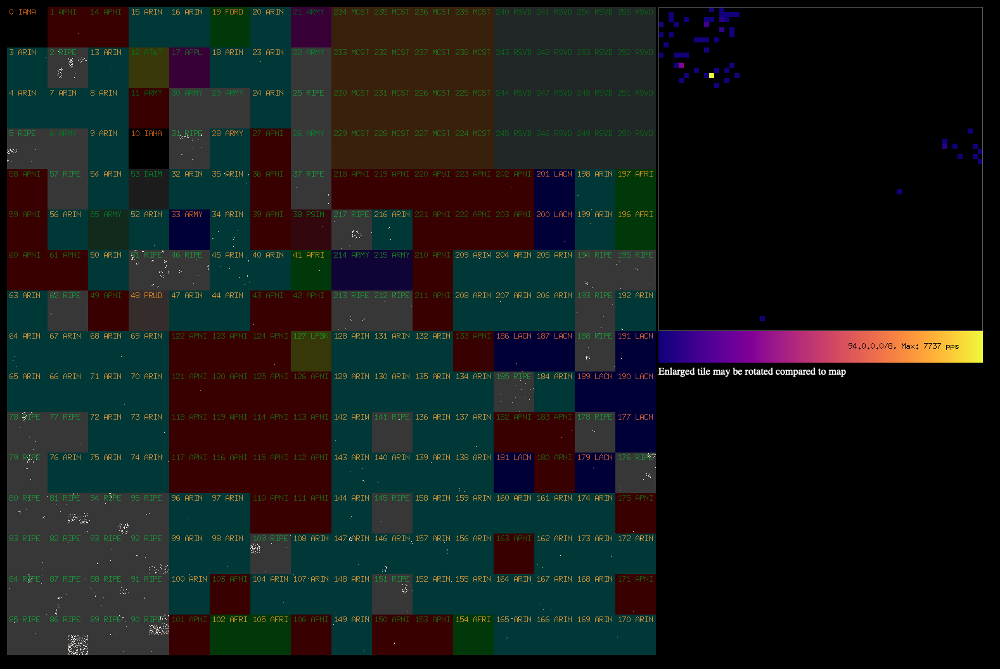

# Hilbert map of traffic

This sample utility pulls an array of 1048576 counters (one per /20 prefix -
4096 IP addresses per counter) from the /prefixes.json endpoint and
generates a [Hilbert
curve](https://en.wikipedia.org/wiki/Hilbert_curve) rendering of the
last 60s worth of traffic (first rendering is all traffic to date).

A zoomed in tile of the /8 prefix with the highest single counter is
also generated.

Inspired by [xckd](https://xkcd.com/195/).

Run like:

`go run hilbert.go localhost:9999 http://10.11.12.13/prefixes.json`

Then visit `http://localhost:9999/` in your browser.

To zoom in to a specific /8, add the first octet to the URL, eg, `http://localhost:9999/86`

